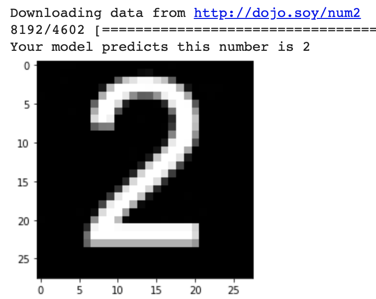

## Introduction

In this project, you'll train a computer to recognise the numbers between zero and nine. You'll also learn to measure how well your machine vision model performs the job you have trained it to do.

### What you will make
You will create a TensorFlow model in a Google Colab notebook that can recognise the numbers between zero and nine from pictures of those numbers.

--- collapse ---
---
title: What you should already know
---
This project assumes you already know some Python. Specifically, it assumes you know how to use:

+ Variables
+ Lists
+ Functions, including how to create your own function that accepts arguments

--- /collapse ---

--- collapse ---
---
title: What you will need
---

+ A computer
+ An internet connection
+ A Google account

--- /collapse ---

--- collapse ---
---
title: What you will learn
---

+ How nodes and layers work in a machine learning model
+ How to build a complete model
+ How to measure the improvement of your model during its training

--- /collapse ---

--- collapse ---
---
title: Additional information for educators
---

If you need to print this project, please use the [printer-friendly version](https://projects.raspberrypi.org/en/projects/integer-classifier/print){:target="_blank"}.

[Here is a link to the resources for this project](http://rpf.io/integer-classifier-go).

--- /collapse ---
