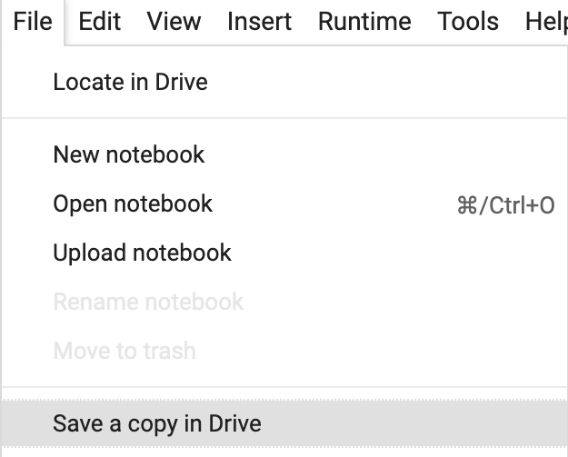

## Get some training data

Before you start to train your model, you need to open the starter Colab notebook for this project and save a copy to your Google Drive.

--- task ---

Open the [Google Colab starter notebook](https://colab.research.google.com/drive/10WmCJwhHJhhsLn4truUUS9Y9bLr5X-jO?usp=sharing){:target="_blank"} for this project in a new tab in your browser.

--- /task ---

--- task ---

Before you change anything, make sure you save the notebook to your drive so you can keep your work! Choose `File > Save a copy in Drive` and sign in to your Google account if prompted.



--- /task ---

To train a model — the process of having a model learn rules for classifying things from a series of examples — you'll need a lot of example data for it. Since you want the model to identify handwritten numbers from zero to nine, you'll need lots of images of those numbers written by different people; they should be properly labelled so that the model can check its own accuracy as it trains.

Conveniently, TensorFlow already contains a dataset like this, which you can load into your program with a couple of lines of code.

--- task ---

First, you need to load the dataset into a variable. In the first empty cell, create a variable called `numbers` and assign the dataset to it like this:

```python
numbers = tf.keras.datasets.mnist
```

`mnist` is just the name of the dataset of numbers you're loading. It stands for 'Modified National Institute of Standards and Technology', which is the name of the group that put it together.
--- /task ---

Now that the data is loaded, you need to put it into some variables so you can use it later. Because the `load_data` function returns two **tuples**, you need to supply the variable names as tuples too.

[[[generic-python-tuples]]]

--- task ---

Below the previous line, assign the output of the `load_data` function to variables for training and validation images and labels.

```python
(training_images, training_labels), (validation_images, validation_labels) = numbers.load_data()
```

--- /task ---

--- save ---
