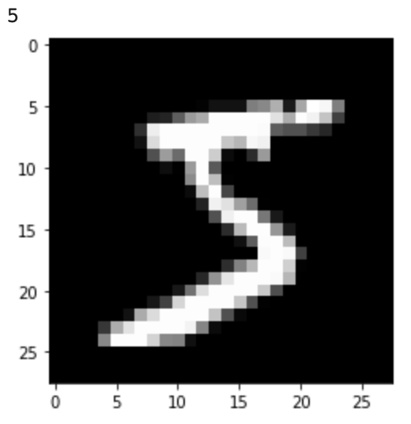
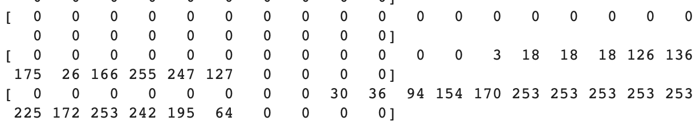
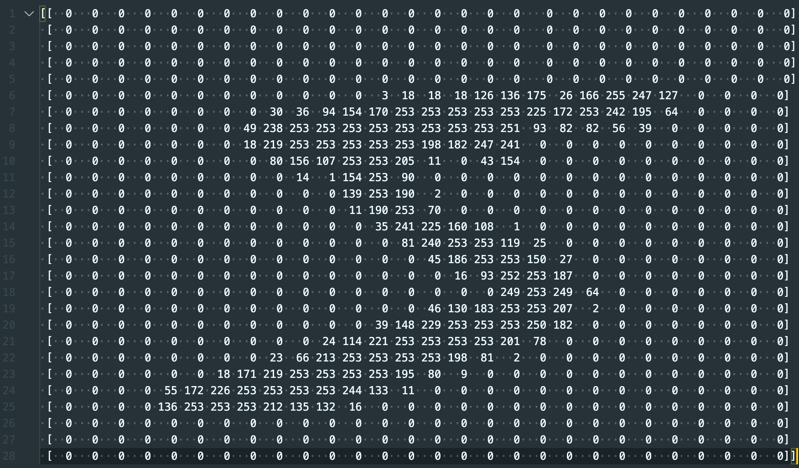

## Explore and prepare your data

Now that you have your data, you're going to take a look at it and do a little work to convert it from a human-readable form to one that suits your model better.

First, just so you know what the data looks like, you need to print out an image and the associated label. For this, you can use `plt.imshow`, which is a function that was imported as part of `matplotlib.pyplot` up at the top of the notebook. Note that this function usually displays colour images, and the MNIST dataset is made up of greyscale (only black, white, and grey) images, so this is something you'll need to tell the `imshow` function.

--- task ---

In the next empty cell, call the `plt.imshow` function, and pass it the first training image, as well as the parameter `cmap= 'gray'` to tell it to use the colour map for a greyscale image. Note that the American spelling of 'gray' must be used. Print out the first training label too.


```python
plt.imshow(training_images[0], cmap='gray')
print(training_labels[0])
```

--- /task ---

--- task ---
Now run the code you've written by going to the `Runtime` menu and choosing `Run all`.

You should see the label, in this case the number five, followed by an image of a five that looks handwritten. 

You'll also see the numbers 0 to 25 along the edges of the image. These are added automatically every five pixels by the `plt.imshow` function and they show the size of the image — 28 pixels wide by 28 pixels high.



--- /task ---

The images are stored in the `training_images` list as numbers. Since you'll work with those numbers in a moment, it's helpful to understand what they look like.

--- task ---

Just below your code to print out the image label, print the image using the standard Python `print` function.

```python
print(training_images[0])
```

--- /task ---

--- task ---

Run the code again.

--- /task ---

As well as what you saw before, you should see a list of lists of numbers. The numbers are mostly zeros, and never over 255. 



It can be hard to see how these are your image, but if you copy them into a text editor and clean them up so that each list is on a line of its own, it becomes clearer. To save you having to do that, here's what it looks like:



There are 28 lists, each with 28 numbers. Each list is a row of pixels, and each number represents a pixel in the image. You can see that the higher the number is, the brighter the corresponding pixel. The zeros appear black, while 255 is the brightest white. Colour images work the same way, but they use three **layers** of these lists, one for each of red, green, and blue. The combination of those layers can make almost 17 million different colours!

[[[generic-theory-simple-colours]]]

However, machine vision models like this one work best when all of the numbers they handle are between zero and one. Sometimes, this means you have to reshape the data you feed into them. 

To reshape your images, you need to divide all of the numbers by 255 to give you values between zero and one. With a normal list, you would have to change each value individually, either in a loop or a list comprehension. However, `numbers.load_data()` did not return normal lists. The function returned **numpy arrays**, which behave a lot like lists, but have some extra features that are very useful for machine learning work. One of those extra features is that you can do the same piece of maths to every item in the array all at once.

--- task ---

In the next cell, below your plotting and printing, add these two lines to divide every item in the `training_images` and `validation_images` arrays by 255.

```python
training_images = training_images / 255.0
validation_images = validation_images / 255.0
```

--- /task ---

--- save ---
