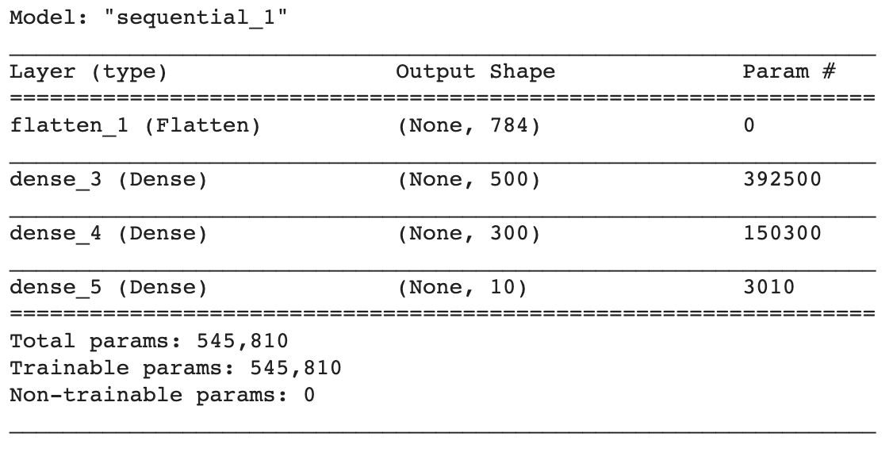

## Compile your model

Now that you've designed your model, you need to compile it. Compiling a model prepares it for training; it gives it instructions on how to improve itself — which is called the model's **optimizer** — and on how to measure that improvement using a **loss function** — a mathematical rule that the model uses to tell how well it's doing in training. 

The optimizer works to make the loss as small as possible. It tries out different rules as it passes through groups of images, called **batches** from the training data. At the start of a batch, the optimizer adjusts the rules based on how well the loss function told the optimizer the model worked in the last batch (the first batch will use random rules). Then it feeds every image into the model with the new rules and checks its losses again. It repeats until it has used all of the training data and then goes through the whole set of training data again, as many times as you tell it to. Each complete pass through the training data is called an **epoch**. The optimizer also uses the validation data to make sure it is not learning rules that work only on the training data. This problem is known as **overfitting**, because training a model is sometimes called **fitting** it.

Programmers don't usually write their own optimizers or loss functions. They use functions created by experts in mathematics and machine learning. Choosing the right ones may take some research, and a little experimentation — for example training the model using two different optimizers and measuring which produces the best result. In the case of this problem, the Adam optimizer is a good choice, as is a loss function called sparse categorical cross entropy loss. Both of these are built into TensorFlow for you.

--- task ---

In the next empty cell, add this code to compile your model and see a summary of its structure.

```python
model.compile(optimizer='adam',
              loss=tf.keras.losses.SparseCategoricalCrossentropy(),
              metrics=['accuracy'])

model.summary()
```

--- /task ---

The **metric** you've added is 'accuracy' — this is a percentage measure of how many images the model guessed correctly. The optimizer knows this by checking the image against its label after the model has made a guess. When you train the model, you'll watch this value go up. A score of 1.0 for accuracy is 100 percent, it would mean the model got everything right. 

Usually there are some unusual examples in the data, which are called **outliers**. A well-trained model may still get them wrong, and so would only have an accuracy score between 0.9 and 1.0, but this is not a bad thing. Getting 1.0 would usually suggest that the model has learned some rules that only apply to the training data and so has become overfitted.

--- task ---
Run all the code and look at the model summary.

You should see something like the image below, which shows you each of your four layers. 



--- /task ---

The first column is the type of the layer; the second is the outputs it provides to the next layer; and third is the number of parameters for that layer, which controls the model's rules that the optimizer will adjust. At the bottom, you can see the total number of parameters, and how many of them you are training — in the case of this model it's over half a million!

--- save ---
