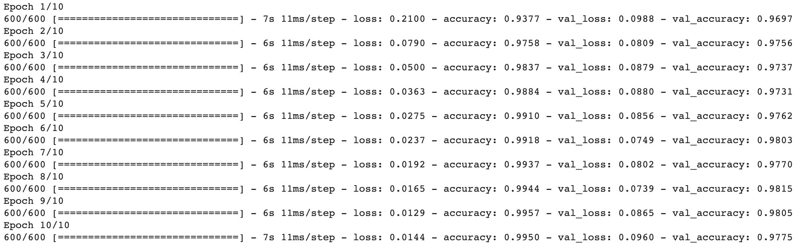
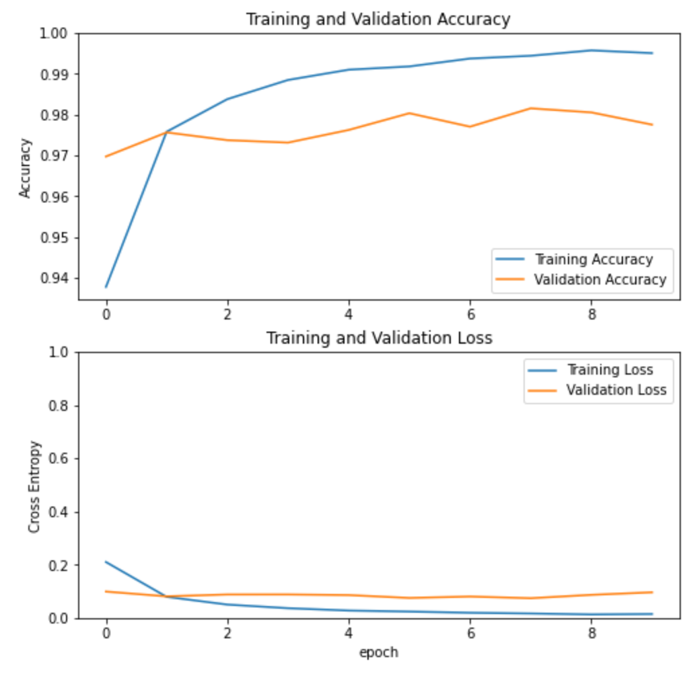

## Train your model

Now that it's compiled, your model is ready for training. Since you're also going to graph the model's performance once it's done, you want to store the output of the training function, the history of the training, in a variable too.

--- task ---

Create a `history` variable and assign the output of `model.fit()` to it (remember that training is sometimes called fitting). Pass the training and validation data you prepared, along with the size of the batches you want to break the data into, and the number epochs — complete runs through the data — you want the model to do before it finishes training. A batch size of 100 and 10 epochs seem to work well for this model.

```python
history = model.fit(training_images,
                    training_labels,
                    batch_size=100,
                    epochs=10,
                    validation_data = (validation_images, validation_labels)
                    )
```

--- /task ---

--- task ---

Below the call to `model.fit()`, add a call to the `plot_accuracy_and_loss()` function provided with the notebook, to produce a graph of how your model improved over time. Pass it the `history` variable you just created.

```python
plot_accuracy_and_loss(history)
```

--- /task ---

--- task ---

Run all the code.

You will probably have to wait about a minute for training to complete. Watch the loss reduce and the accuracy increase as each batch and epoch completes. There are 600 batches in an epoch, because there are 60,000 images in your data.

Once the training is finished, you should see some output like that in the image below, though your numbers may be slightly different.



You should also see a graph that shows the improvement of your model over the course of the training, as accuracy increased and loss decreased.

--- /task ---



The left-hand side of the graph shows where the accuracy or loss started at the end of the first epoch, moving right as epochs passed. You can see that the slope of the line was initially very steeply up for accuracy, and steeply down for loss. Over time, the changes became less steep as the model went from making major discoveries about important rules, to making minor improvements on rules it had learned in an earlier epoch.

--- save ---
