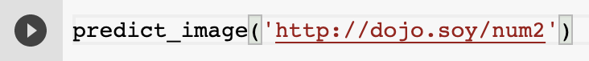

## Test your model

Now that you've trained your number recognition model, it's time to see how well it does on some numbers you create!

--- task ---

In the last empty cell, add a call to `predict_image` and pass it the URL of the test image at [http://dojo.soy/num2](http://dojo.soy/num2).

```python
predict_image('http://dojo.soy/num2')
```

--- /task ---

--- task ---

Run just this cell, so your model doesn't train itself again. Click on the ▶ button that appears to the left of it.



--- /task ---

You should see something like the image below, which gives your model's prediction and a preview of the image you loaded.


--- save ---

--- task ---

Use your favourite image editing program to make a square black `jpg` or `png` file with a single white digit in it. Try different fonts, or draw the number yourself. Since this is a small model that you trained pretty quickly, it will be wrong quite often, but it's possible to build and train much more accurate models when they're needed. If you don't have an image editor, you can use a website like [autodraw.com](https://www.autodraw.com/), or [download and install GIMP](https://www.gimp.org/downloads/).

--- /task ---

--- task ---

Once you've saved your file, you'll need to host it online so Colab can access it. Follow the instructions below to see how to store them in your Google Drive and get the URLs that Colab can use.

--- /task ---

[[[generic-google-drive-image]]]
